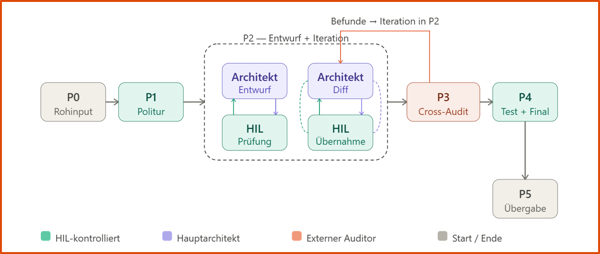
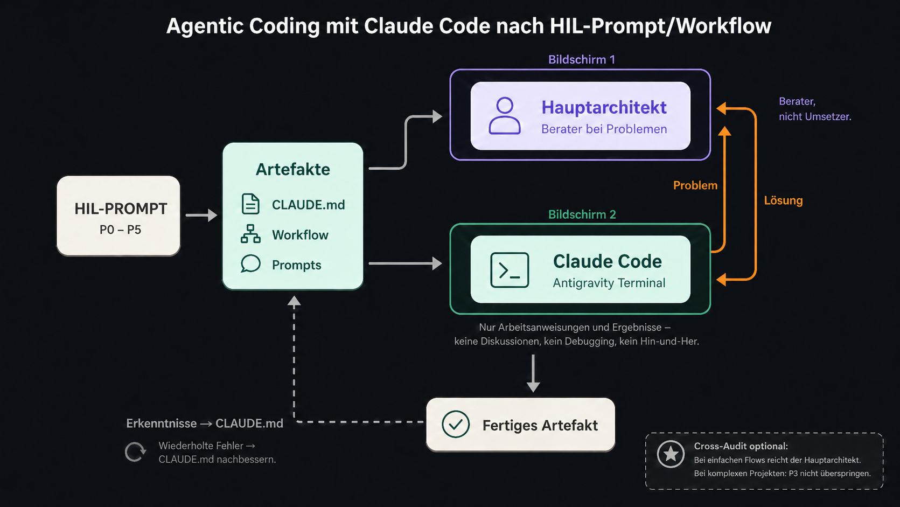

# HIL-PROMPT — A Human-in-the-Loop Workflow for Developing Complex Prompts & Workflows for Vibe Coding

**Autor:** Prof. Dr. Jaromir Konecny & Claude Opus 4.6  
**Version:** 1.0  
**Datum:** Mai 2026  
**Lizenz:** CC BY 4.0



## 1. Titel des Workflows

**HIL-PROMPT v1.0**
*Human-in-the-Loop Multi-Model Prompt-Engineering-Workflow für die kontrollierte Erstellung von Prompts, Anleitungen, Claude.md-Dateien, Workflow-Dokumenten und unterstützenden Python-Skripten für Claude Code. Vorbereitungsphase für Vibe Coding*

---

## 2. Kurzbeschreibung

Ein mehrstufiger, explizit menschlich gesteuerter Workflow, der rohe Sprachinputs über eine Kette spezialisierter Modell-Rollen (PromptPolierer → Hauptarchitekt → externer Auditor) in produktionsreife Artefakte überführt. Die zentrale Eigenschaft ist die **strikte Trennung zwischen Generierung und Revision**: Änderungen erfolgen nach der Erstgenerierung ausschließlich als **lokale, diff-basierte Anweisungen**, nie als Gesamt-Neuausgabe. Der Mensch behält in jeder Phase die Hoheit über Übernahme, Ablehnung oder Rückfrage. Der Workflow ist gegen Prompt-Drift, Sycophancy und stille Mutation akzeptierter Passagen gehärtet.

---

## 3. Phasenmodell

Der Workflow besteht aus **sechs Phasen** (P0–P5). P2 ist eine iterative Schleife zwischen Hauptarchitekt und HIL; alle anderen Phasen sind sequentiell.

### P0 — Rohinput (Diktat)
- **Input:** Unstrukturierte Idee im Kopf.
- **Werkzeug:** Diktierfunktion (ChatGPT Voice, Whisper o. ä. bzw. schnelles Eintippen der eigenen Gedanken).
- **Output:** Rohtext, redundant, sprunghaft, ungefiltert.
- **Regel:** Keine Selbstzensur beim Diktieren. Alles was relevant erscheint, wird gesprochen.
- **Übergabe:** Rohtext wird als Ganzes an den Promptpolierer gegeben.

### P1 — Promptpolitur + HIL-Check
- **Zielmodell:** Spezialisiertes GPT („Promptpolierer"): https://chatgpt.com/g/g-69357e86d2708191859d1ec6c3a89d2f-promptpolierer
- **Aufgabe:** Redundanz entfernen, Ziele extrahieren, implizite Anforderungen explizit machen, Struktur geben, Markdown-Format-ideal für Prompts.
- **Output:** Bereinigter, strukturierter Meta-Prompt — noch kein Artefakt, sondern die Aufgabenbeschreibung für den Hauptarchitekten.
- **HIL-Kontrolle (verbindlich):** HIL liest den polierten Meta-Prompt durch und streicht alle Ergänzungen, die der Promptpolierer über den Rohinput hinaus eingefügt hat ("angedichteter Kontext"). Sprachmodelle neigen dazu, Lücken in unstrukturierten Inputs durch Eigeninterpretation zu füllen. Hier wird nicht an Formulierungen gefeilt — Ziel ist ausschließlich, dass der Meta-Prompt exakt die gewollte Aufgabe abbildet, nicht mehr und nicht weniger. Eine solide Grundlage hier erspart Drift in P2.
- **Abnahmekriterium:** Der polierte Prompt enthält Ziel, Kontext, Rahmenbedingungen, Ausgabeformat, Qualitätskriterien und wurde von der HIL-Kontrolle freigegeben.
- **Abschluss:** Der Promptpolierer wird geschlossen. Ab hier wird ausschließlich mit dem Hauptarchitekten gearbeitet.

### P2 — Entwurf + Iteration
- **Zielmodell:** Starkes Modell mit langem Kontext (z. B. Claude Opus).
- **Akteure:** Hauptarchitekt und HIL im Wechsel.

**Schritt 1 — Erstentwurf:**
Der Hauptarchitekt erstellt aus dem polierten Meta-Prompt einen vollständigen Erstentwurf. Pflicht-Ausgabeformat: Markdown innerhalb eines einzigen Codeblocks (Dreifach-Backticks mit Sprachkennung „markdown"), damit der Inhalt sauber in einen Editor kopiert werden kann. Der Kopf des Dokuments enthält: Versionsnummer (v0.1), Datum, Zielsystem, offene Unsicherheiten als `UNSICHER: …`-Zeilen.

**Schritt 2 — Iterativer Loop:**
HIL und Hauptarchitekt arbeiten den Entwurf abschnittsweise durch. Dieser Loop läuft so lange, bis HIL den Stand als stabil bewertet. Drei verbindliche Regeln gelten innerhalb des Loops:

1. **Advocatus-Diaboli-Diskussion:** HIL geht Abschnitt für Abschnitt durch, stellt Fragen, äußert Zweifel, fordert Begründungen. Der Hauptarchitekt muss widersprechen, wenn HILs Einwand falsch ist. Zustimmung nur bei echter Überzeugung. Pro Abschnitt endet die Diskussion mit einer klaren Entscheidung: behalten, ändern, streichen oder recherchieren.

2. **Diff-only-Regel:** Wenn aus der Diskussion eine Änderung folgt, liefert der Hauptarchitekt ausschließlich einen Änderungsblock im vorgeschriebenen Format (siehe Abschnitt 5). Keine vollständige Neuausgabe der Datei.

3. **Konsistenzcheck:** Nach ca. fünf übernommenen Änderungen übergibt HIL die aktuelle Gesamtversion erneut an den Hauptarchitekten mit dem Auftrag: „Prüfe auf Inkonsistenzen, die durch die Einzeländerungen entstanden sein könnten. Gib nur einen Befund-Bericht, keine Neuausgabe." Bei Befunden wird der Loop fortgesetzt.

**Entscheidung bei grundlegendem Missverhältnis:** Wenn der Erstentwurf fundamental in die falsche Richtung zielt, weist HIL den Hauptarchitekten gezielt auf die Lücke oder das Missverständnis hin und fordert einen neuen Erstentwurf an. Kein Rücksprung zum PromptPolierer — der Meta-Prompt gilt nach der HIL-Kontrolle in P1 als stabil. Kein Verbessern-per-Chat eines fundamental falschen Entwurfs; bei strukturellen Problemen wird neu generiert, nicht geflickt.

- **Abnahmekriterium:** Zwei aufeinanderfolgende Konsistenzchecks liefern keine substanziellen Befunde mehr. HIL erklärt den Stand als stabil für das Cross-Audit.

### P3 — Cross-Audit
- **Zielmodell:** Ein **anderes** starkes Modell als der Hauptarchitekt (z. B. GPT-5.5, Gemini 3.1 Pro, eine andere Claude-Familie). Echte Modellvielfalt, nicht dasselbe Modell in neuer Session.
- **Aufgabe:** Unabhängige Prüfung auf Schwächen, Logiklücken, Sicherheitsrisiken, unklare Instruktionen, Konflikte mit Claude-Code-Konventionen.
- **Kontextregel:** Der Auditor erhält nur das aktuelle Artefakt und eine kurze Aufgabenbeschreibung — nicht die Chat-History. Damit wird Confirmation Bias vermieden.
- **Output:** Strukturierter Audit-Bericht im Format aus Abschnitt 6.

**Triage der Audit-Befunde:**
HIL legt die Befunde des Auditors dem Hauptarchitekten einzeln vor. Der Hauptarchitekt ordnet jeden Befund in eine von drei Kategorien ein:

1. **Scheinproblem** — mit kurzer Begründung, warum der Befund nicht zutrifft.
2. **Echtes Problem, wichtig** — wird sofort adressiert; zurück in den P2-Loop (Diskussion + Diff).
3. **Nice-to-have** — berechtigt, aber nicht blockierend; wird als offener Punkt dokumentiert und kann z. B. später bei der Nutzung in Claude Code eingepflegt werden.

HIL entscheidet pro Befund, ob die Einordnung des Hauptarchitekten überzeugt. Kein Befund wird ohne Diskussion übernommen, kein Befund wird ohne Begründung verworfen. Die Iteration zwischen P3 und P2 läuft so lange, bis alle als „echtes Problem" eingestuften Befunde aufgelöst sind.

- **Abnahmekriterium:** Keine offenen Blocker. Alle „echten Probleme" sind adressiert und im Artefakt eingepflegt.

### P4 — Finalisierung + Test
- **Akteur:** HIL.
- **Aufgabe:**
  - Versionsnummer fixieren (z. B. v1.0-final).
  - Alle `UNSICHER:`- und `UNBELEGT:`-Marker müssen aufgelöst sein.
  - Datei-Kopf mit Metadaten vervollständigen (Version, Datum, Zielsystem, Autor).
  - Testdurchlauf: Das fertige Artefakt wird in einer sauberen Claude-Code-Session mit einem realistischen Testauftrag verwendet.
- **Abnahmekriterium:** Claude Code führt den Testauftrag wie beabsichtigt aus, ohne Rückfragen die auf Lücken im Artefakt deuten.

### P5 — Übergabe
- **Aufgabe:** Das Artefakt wird in die Workspace-Struktur eingebettet (`CLAUDE.md`, `Prompts/`, `Workflows/` usw.).
- **Pflicht:** Jede freigegebene Version wird gesichert — per Git-Commit, per Dateikopie mit Versionsnummer im Dateinamen, oder per ZIP-Archiv. Entscheidend ist nicht das Werkzeug, sondern dass jeder Zwischenstand wiederherstellbar ist.
- **Langzeit:** Jedes produktiv genutzte Artefakt hat eine Review-Frist (z. B. 3 Monate), nach der es erneut durch P3 läuft.

---

## 4. Detailregeln

### 4.1 Rollen der Modelle

| Rolle | Empfohlenes Modell | Kernaufgabe | Vermeiden |
|---|---|---|---|
| **Rohtext-Polierer** | Spezialisiertes GPT („Promptpolierer“) | Struktur aus Diktat ziehen, Redundanz entfernen | Inhaltliche Erweiterung, Erfindung neuer Anforderungen |
| **Hauptarchitekt** | Claude Opus (langer Kontext, starkes Reasoning) | Erstentwurf, Line-Level-Diskussion, Diff-Vorschläge | Neuausgabe der ganzen Datei bei Teiländerungen |
| **Externer Auditor** | Anderes Modellfamilie (GPT-5, Gemini Pro, o. ä.) | Unabhängige Zweitmeinung | Übernahme ohne Prüfung |
| **Umsetzer** | Claude Code (CLI) | Ausführung des fertigen Artefakts im Workspace | Interpretation eigener Vorlieben, wenn Prompt klar ist |

### 4.2 Kommunikationsregeln für das Hauptmodell

Diese Regeln werden als **System-Prompt-Präambel** an jede Sitzung mit dem Hauptarchitekten angehängt.

1. **Keine Neuausgabe bei lokalen Änderungen.** Wenn HIL eine einzelne Stelle diskutiert oder ändern will, antwortest du **niemals mit der gesamten Datei**. Antworte mit Analyse oder mit einem Änderungsblock im vorgeschriebenen Format (siehe Abschnitt 5).
2. **Ehrlicher Widerspruch vor Gefälligkeit.** Wenn du HILs Einwand für falsch hältst, sagst du das offen und begründest. Zustimmung nur bei echter Überzeugung.
3. **Unsicherheit explizit machen.** Wenn du eine Aussage nicht belegen kannst, schreibe `UNSICHER:` oder `UNBELEGT:` davor. Keine selbstsicheren Formulierungen bei tatsächlicher Unsicherheit.
4. **Websuche aktiv vorschlagen.** Bei Fakten, APIs, Versionen, aktuellem Tooling: „Das sollte verifiziert werden, ich schlage eine Websuche zu XYZ vor.“
5. **Kein Marketing-Stil.** Keine Füllwörter, keine Selbstlobformeln, keine „natürlich!“, „gerne!“, „das ist eine ausgezeichnete Frage!“ — direkt zur Sache.
6. **Ausgabesprache folgt Inputsprache.** Deutsch bei deutschem Input. Englisch nur bei hochspezialisierten Themen mit schwacher deutscher Datenlage, dann mit einzeiliger Begründung.

---

## 5. Änderungsprotokoll-Format

Jede vom Modell vorgeschlagene Änderung folgt exakt diesem Schema. Das Format ist verbindlich — Abweichungen sind ein Fehler des Modells.

```
## Änderung #<laufende Nummer>

- **Datei/Abschnitt:** <z. B. CLAUDE.md → Abschnitt "Tools">
- **Zeile(n) (ungefähr):** <z. B. Z. 42–45>
- **Typ:** <ersetzen | einfügen | löschen | umordnen>
- **Alt (wörtlich):**
  ```
  <exakter bisheriger Wortlaut>
  ```
- **Neu (wörtlich):**
  ```
  <exakter neuer Wortlaut>
  ```
- **Begründung:** <warum — inhaltlich, nicht stilistisch>
- **Abhängigkeiten:** <welche anderen Stellen sind davon betroffen, oder "keine">
- **Risiko:** <niedrig | mittel | hoch> — <kurze Begründung>
- **Empfehlung:** <manuell übernehmen | prüfen und anpassen | verwerfen>
- **Nach Übernahme zu prüfen:** <konkrete Folgecheckpoints, oder "keine">
```

**Regeln:**
- `Alt` und `Neu` werden **wörtlich** ausgegeben, ohne Ellipsen.
- Mehrere Änderungen werden durchnummeriert und einzeln aufgeführt, nie zusammengefasst.
- Wenn ein Vorschlag mehrere Abschnitte betrifft, wird er in mehrere Änderungen aufgeteilt.
- HIL übernimmt jede Änderung **einzeln** im Editor. Regelmäßige Zwischensicherung nach eigenem Ermessen.

---

## 6. Audit-Logik

### 6.1 Auditauftrag (Cross-Model)

Der externe Auditor erhält:
1. Die vollständige aktuelle Version des Artefakts.
2. Eine **bewusst kurze** Aufgabenbeschreibung — nicht den gesamten Entstehungsverlauf, um Confirmation Bias zu vermeiden.
3. Eine explizite Anforderungsliste: „Finde Schwächen, keine Lobhudelei.“

### 6.2 Audit-Berichtformat

Der Auditor liefert:

```
# Audit-Bericht — <Artefaktname> v<Version> — <Datum> — <Auditor-Modell>

## Zusammenfassung
<3–5 Sätze: Gesamteindruck, Reifestand, Ampelstatus grün/gelb/rot>

## Echte Probleme (Blocker — müssen vor Freigabe gelöst werden)
- [E1] <Beschreibung> — Ort: <Abschnitt/Zeile> — Empfehlung: <...>
...

## Nice-to-have (berechtigt, aber nicht blockierend)
- [N1] <Beschreibung> — Ort: <Abschnitt/Zeile> — Empfehlung: <...>
...

## Scheinprobleme (vom Auditor gemeldet, aber vermutlich unbegründet)
- [S1] <Beschreibung> — Ort: <Abschnitt/Zeile> — Begründung des Auditors: <...>
...

## Offene Fragen an den Autor
<Fragen, die der Auditor aus dem Artefakt allein nicht klären kann>
```

---

## 7. Qualitäts- und Reifestandskriterien

### 7.1 Qualitätskriterien (Must-Have)

Ein Artefakt gilt erst dann als ausgereift, wenn **alle** folgenden Kriterien erfüllt sind:

1. **Klarheit:** Jede Anweisung ist so formuliert, dass sie ohne Rückfrage ausführbar ist.
2. **Widerspruchsfreiheit:** Keine Regel widerspricht einer anderen Regel im selben Dokument oder in referenzierten Dateien.
3. **Vollständigkeit:** Alle im Zielkontext auftretenden Fälle sind abgedeckt; Standardfall und Randfälle benannt.
4. **Testbarkeit:** Für jeden wichtigen Anspruch existiert ein konkreter Testfall, mit dem geprüft werden kann, ob Claude Code ihn erfüllt.
5. **Änderungsrobustheit:** Das Artefakt bleibt konsistent, wenn einzelne Abschnitte modifiziert werden (d. h. keine versteckten Kopplungen).
6. **Geringe Interpretationsspielräume:** Keine vagen Modalverben („sollte eventuell“), keine unklaren Referenzen („das obige“).
7. **Übergabefähigkeit:** Ein anderer Mensch (oder eine neue Claude-Session ohne Vorwissen) versteht das Artefakt beim ersten Lesen.
8. **Determinismus bei kritischen Stellen:** Sicherheitsrelevante Anweisungen sind imperativ („nie X tun“, nicht „möglichst nicht X tun“).

### 7.2 Reifestandskriterien (Abbruchkriterien der Iteration)

Der Iterationsprozess darf beendet werden, wenn **alle** folgenden Punkte zutreffen:

- Zwei aufeinanderfolgende Konsistenzchecks (P2) liefern keine substanziellen Befunde mehr.
- Mindestens **ein** Cross-Model-Audit (P3) hat stattgefunden und seine Hinweise sind aufgelöst.
- Keine `UNSICHER:`- oder `UNBELEGT:`-Marker mehr im Dokument.
- Testdurchlauf in P4 war erfolgreich.
- Die Versionshistorie zeigt einen nachvollziehbaren Entwicklungspfad.

### 7.3 Zwangs-Weiterprüfung

Iteration **muss** fortgesetzt werden, wenn:

- Mehr als drei Änderungen in einer Runde erfolgten (deutet auf strukturelle Probleme).
- Das Audit einen Blocker liefert, auch wenn HIL ihn ablehnen will — dann mindestens Hauptarchitekt konsultieren.
- HIL selbst ein ungutes Gefühl bei einer Sektion hat. Unausgesprochene Zweifel führen später zu Produktionsfehlern.

---

## 8. Risiken und Gegenmaßnahmen

| # | Risiko | Erscheinungsform | Gegenmaßnahme |
|---|---|---|---|
| R1 | **Prompt-Drift** | Akzeptierte Passagen werden bei späteren Änderungen unbemerkt umformuliert. | Diff-Only-Regel; Zwischensicherung nach Änderungen; Textvergleich vor Speichern. |
| R2 | **Stille Mutation durch Neuausgabe** | Modell gibt „zur Übersicht“ die ganze Datei neu aus, verändert dabei andere Stellen. | Harte System-Prompt-Regel: „Niemals Gesamtausgabe bei lokalen Änderungen.“ Verstoß = Abbruch der Antwort, Nachforderung im Diff-Format. |
| R3 | **Halluzinationen bei Fakten** | API-Signaturen, Versionsnummern, Bibliotheksverhalten werden erfunden. | Zwingender `UNSICHER:`-Marker; Websuche-Aufforderung bei jeder technischen Behauptung; Cross-Model-Audit. |
| R4 | **Sycophancy** | Modell stimmt HILs Einwänden zu, obwohl der Originalvorschlag besser war. | Explizite Advocatus-Diaboli-Instruktion; gelegentlich umgekehrter Test: HIL stellt bewusst falschen Einwand auf und prüft, ob das Modell widerspricht. |
| R5 | **Kontextverlust in langen Chats** | Frühere Entscheidungen werden in späten Nachrichten ignoriert. | Session-Splitting: Nach ca. 30–40 Turns neue Session starten und aktuelle Datei + CHANGELOG als Kontext einspielen. Konsistenzcheck (P2) obligatorisch. |
| R6 | **Redundante oder widersprüchliche Regeln** | Dokument sagt an einer Stelle A, an anderer nicht-A. | P3 Gesamtprüfung; Auditor-Prompt explizit auf Widerspruchssuche ansetzen. |
| R7 | **Falsche Sicherheit trotz fehlender Verifikation** | Dokument wirkt poliert, aber niemand hat es am echten System getestet. | P4 Testdurchlauf ist nicht optional. Kein Artefakt ohne Live-Test mit Claude Code. |
| R8 | **Overfitting auf ein Modell** | Prompt funktioniert nur mit Claude Opus, versagt mit anderen Modellen oder anderen Claude-Versionen. | Gelegentlicher Cross-Run: Testauftrag mit Claude Code + anderer Modellversion durchführen. |
| R9 | **Erschöpfung durch zu viele Iterationen** | HIL verliert Überblick, macht Flüchtigkeitsfehler. | Klare Reifestandskriterien (7.2) respektieren; Pausen einlegen; bei Frustration lieber Session beenden und am nächsten Tag weiter. |
| R10 | **Vermischung von Meta- und Inhaltsebene** | In der Diskussion über ein Artefakt wird Text produziert, der versehentlich als Teil des Artefakts übernommen wird. | Diskussions-Output niemals direkt kopieren. Nur Inhalte aus Änderungsblöcken (Abschnitt 5) wandern in die Datei. |

---

## 9. Standard-Promptbausteine

Alle Templates sind so formuliert, dass sie per Copy-Paste einsetzbar sind. Platzhalter in `<...>`.

### 9.1 Prompt an das Hauptmodell (Erstentwurf, P2)

```
Du bist der Hauptarchitekt für die Erstellung eines <Artefakttyp: z. B. 
CLAUDE.md-Datei / Workflow-Prompt / Python-Skript>. Ich arbeite nach einem 
strengen Human-in-the-Loop-Prozess (HIL-PROMPT v1.0).

Verbindliche Regeln:
1. Gib den Erstentwurf in Markdown innerhalb EINES Codeblocks aus.
2. Kopf des Dokuments enthält: Version (v0.1), Datum, Zielsystem, offene 
   Unsicherheiten als "UNSICHER:"-Zeilen.
3. Markiere Platzhalter deutlich, erfinde keine Fakten.
4. Bei technischen Behauptungen, die du nicht sicher belegen kannst: 
   "UNSICHER:"-Marker setzen und Verifikation vorschlagen.
5. In späteren Diskussionsrunden gibst du NIEMALS die gesamte Datei neu 
   aus. Änderungen kommen ausschließlich im Änderungsprotokoll-Format 
   (siehe unten).
6. Kein Marketing-Stil, keine Füllwörter.

Aufgabenbeschreibung (polierter Meta-Prompt):
<hier den Output des Promptpolierers einfügen>

Erzeuge jetzt v0.1.
```

### 9.2 Prompt für die zeilenweise Diskussion (P2, Schritt 2)

```
Ich diskutiere jetzt mit dir Abschnitt für Abschnitt. Regeln für deine 
Antworten in dieser Phase:

1. Keine Neuausgabe der Datei, auch nicht in Auszügen, außer ich fordere 
   es explizit.
2. Antworte als Analyse-Text.
3. Wenn du meinem Einwand zustimmst, sag warum.
4. Wenn du ihm nicht zustimmst, widersprich klar und begründet.
5. Wenn du unsicher bist, sag es.
6. Wenn du externe Verifikation empfiehlst (Websuche, Doku-Check), sag das.

Zu diskutierender Abschnitt (Zitat aus aktueller Version):
"""
<wörtliches Zitat der betroffenen Stelle>
"""

Mein Punkt / meine Frage / mein Zweifel:
<Text>
```

### 9.3 Prompt für lokale Änderungsanweisung (P2, Diff-Regel)

```
Aus unserer Diskussion ergibt sich eine Änderung. Gib sie ausschließlich 
im folgenden Format aus. Keine Einleitung, kein Fazit, kein Dateiauszug 
darüber hinaus.

## Änderung #<Nummer>

- **Datei/Abschnitt:** ...
- **Zeile(n) (ungefähr):** ...
- **Typ:** ersetzen | einfügen | löschen | umordnen
- **Alt (wörtlich):**
  ```
  ...
  ```
- **Neu (wörtlich):**
  ```
  ...
  ```
- **Begründung:** ...
- **Abhängigkeiten:** ...
- **Risiko:** niedrig | mittel | hoch — ...
- **Empfehlung:** manuell übernehmen | prüfen und anpassen | verwerfen
- **Nach Übernahme zu prüfen:** ...

Hinweis: Wenn die Änderung mehrere Abschnitte betrifft, gib mehrere 
Änderungsblöcke aus — nicht zusammenfassen.
```

### 9.4 Prompt für Gesamtprüfung nach mehreren Änderungen (P2, Konsistenzcheck)

```
Ich habe seit deinem letzten Gesamtblick die folgenden Änderungen 
eingepflegt: <Kurzliste der Änderungen #N bis #M>.

Hier ist die aktuelle vollständige Version:
```
<Dateiinhalt>
```

Prüfe auf:
- neu entstandene Widersprüche zwischen Abschnitten,
- inkonsistente Terminologie,
- Verweise, die ins Leere laufen,
- Regeln, die sich gegenseitig aushebeln,
- verloren gegangene frühere Entscheidungen.

Gib NUR einen Befund-Bericht aus, keine neue Dateiversion. Format:
- [Nr] Ort: <Abschnitt/Zeile> — Befund: ... — Schweregrad: hoch/mittel/niedrig — Empfehlung: ...
```

### 9.5 Prompt für das Audit durch ein zweites Modell (P3)

```
Du bist unabhängiger Auditor für ein Prompt-/Workflow-Artefakt. Du kennst 
den Entstehungsverlauf nicht — das ist beabsichtigt. Deine Aufgabe ist 
kritische Prüfung, nicht Lob.

Artefakt: <Name, Version, Zielsystem Claude Code>

Prüfe insbesondere:
1. Klarheit und Eindeutigkeit jeder Anweisung.
2. Widerspruchsfreiheit zwischen Regeln.
3. Vollständigkeit bezogen auf typische Anwendungsfälle.
4. Sicherheits- und Konsistenzrisiken bei Ausführung durch Claude Code.
5. Fehlende Abfangen von Randfällen.
6. Nicht belegte Behauptungen über Tools, APIs, Libraries, Versionen.
7. Stilprobleme nur am Rande — Substanz zuerst.

Ausgabeformat: siehe HIL-PROMPT Abschnitt 6.2.

Artefaktinhalt:
```
<Datei>
```
```

### 9.6 Prompt für die Endabnahme (P4)

```
Endabnahme v<X.Y>. Prüfe Checkliste:

- [ ] Alle "UNSICHER:"- und "UNBELEGT:"-Marker aufgelöst.
- [ ] Kopf-Metadaten vollständig (Version, Datum, Zielsystem, Autor).
- [ ] Keine offenen Blocker aus Audit.
- [ ] Zwei aufeinanderfolgende P2-Durchläufe ohne substanzielle Befunde.
- [ ] Live-Testauftrag mit Claude Code vorbereitet: <Testaufgabe>.

Geh die Liste Punkt für Punkt durch. Bei jedem Punkt: erfüllt / nicht erfüllt, 
mit Beleg oder Verweis. Bei "nicht erfüllt": Empfehlung zur Behebung.

Keine Neuausgabe der Datei.

Aktueller Stand:
```
<Datei>
```
```
```
---

# Diagramm einer ausgezeichneten Workflow-Anwendung: **Agentic Coding für Claude Code**  



*Ende HIL-PROMPT v1.0*
